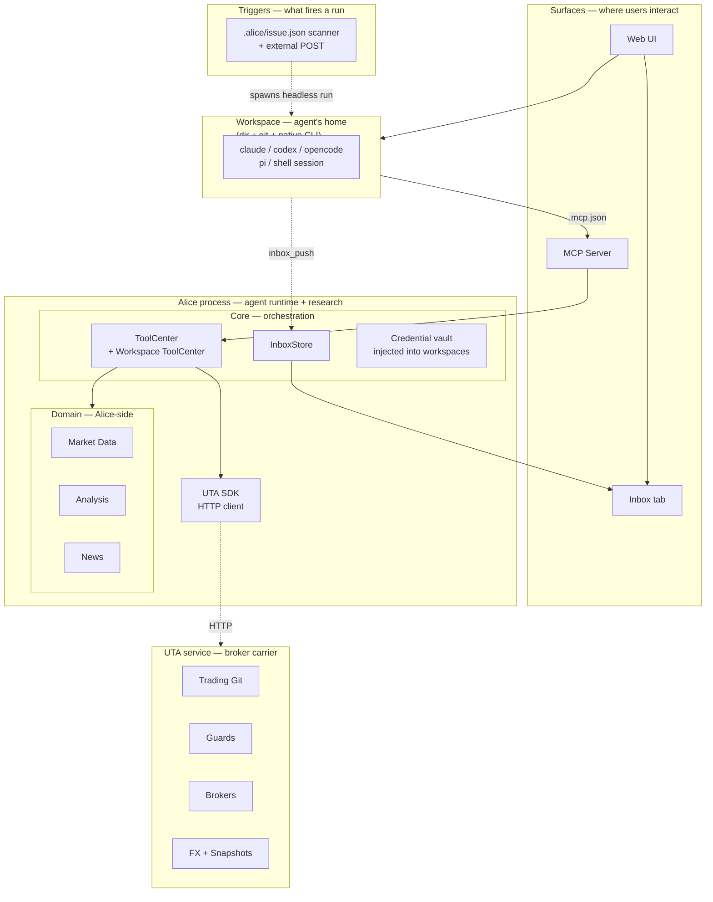

<p align="center">
  
</p>

<h1 align="center">OpenAlice</h1>

<p align="center">
  <strong>Your one-person Wall Street.</strong><br>
  An AI trading agent covering equities, crypto, commodities, forex, and macro — from research through position entry, ongoing management, to exit.
</p>

<p align="center">
  <a href="https://openalice.ai"></a> · <a href="https://openalice.ai/docs"></a> · <a href="https://x.com/OpenAliceAI"></a> · <a href="https://discord.gg/zf4STmrQd8"></a> · <a href="https://qm.qq.com/q/iSg6O4FmrC"></a>
</p>

<p align="center">
  
</p>

- **Full-spectrum** — analyze and trade across asset classes. Multiple brokers combine into one unified workspace so you're never stuck with "I can see it but can't trade it."
- **Full-lifecycle** — not just entry signals. Research, position sizing, ongoing monitoring, risk management, and exit decisions — Alice covers the entire trading lifecycle, 24/7.
- **Full-control** — every trade goes through version history and safety checks, and requires your explicit approval before execution. You see every step, you can stop every step.

Alice runs on your own machine, because trading involves private keys and real money — that trust can't be outsourced.

> [!CAUTION]
> **OpenAlice is experimental software in active development.** Many features and interfaces are incomplete and subject to breaking changes. Do not use this software for live trading with real funds unless you fully understand and accept the risks involved. The authors provide no guarantees of correctness, reliability, or profitability, and accept no liability for financial losses.

## Features

### Trading

- **Unified Trading Account (UTA)** — multiple brokers (CCXT, Alpaca, Interactive Brokers) combine into unified workspaces. AI interacts with UTAs, never with brokers directly
- **Trading-as-Git** — stage orders, commit with a message, push to execute. Full history reviewable with commit hashes
- **Guard pipeline** — pre-execution safety checks (max position size, cooldown, symbol whitelist) per account
- **Account snapshots** — periodic and event-driven state capture with equity curve visualization

### Research & Analysis

- **Market data** — equity, crypto, commodity, currency, and macro data, **zero API keys out of the box**: low-frequency boards and datasets are served by the hosted **TraderHub** (https://traderhub.openalice.ai), with your own provider keys as the fallback path. Unified cross-asset symbol search and technical indicator calculator
- **Fundamental research** — company profiles, financial statements, ratios, analyst estimates, earnings calendar, insider trading, and market movers. Currently deepest for equities, expanding to other asset classes
- **News** — background RSS collection with archive search

### Automation

Automation runs a Workspace **headless on a trigger** — the same Workspace substrate, spawned non-interactively against an agent and a prompt, doing the work and reporting back through the Inbox (and shown live in the Runs tab). One substrate, whether a human opened the workspace or a trigger did.

Two ways a run is triggered:

- **Self-scheduled** — a workspace declares its own schedule in `.alice/issue.json` (interval / cron / one-shot); a dumb scanner discovers declarations and fires due tasks. No central registry — scheduling is a coding task the agent does by writing a file.
- **External** — `POST /api/workspaces/:id/headless` lets any outside system (a webhook bridge, a cron on another host) drive a workspace.

### Interface

- **Web UI** — workspace chat, the Inbox, a portfolio dashboard with equity curve, and full config management
- **Workspace** — a per-task directory + git repo + persistent terminal session running your chosen agent CLI (`claude` / `codex` / `opencode` / `pi` / `shell`) with OpenAlice's MCP tools plumbed in. The recommended path for any non-trivial AI work — native prompt cache, native rendering, no protocol shim
- **Inbox** — workspace-to-user push channel. Agents call `inbox_push` from inside a workspace to surface a document (rendered live) plus a markdown comment in a dedicated tab; click the reply bar to jump back into the workspace and continue
- **MCP server** — tool exposure for external agents

### And More!

- **Multi-provider AI** — the model runs in the native agent CLI; bring any provider via the credential vault (Anthropic, OpenAI, Google, GLM, MiniMax, Kimi, DeepSeek, …) or your CLI's own subscription login
- **Evolution mode** — permission escalation that gives Alice full project access including Bash, enabling self-modification


## Architecture

OpenAlice splits into **two long-lived processes** managed by a thin
supervisor:



**Alice process** holds the agent runtime, research domain (market data,
analysis, news), workspace launcher, and all user-facing surfaces. Alice
**does not** hold broker credentials and does not talk to exchanges
directly. It owns the *deciding* — what to research, when to act, what
to say.

**UTA service** owns the broker connections, the git-like trading state
machine, guards, FX, and snapshot scheduling. AI tools and the
frontend reach it through a thin HTTP SDK — `ctx.utaManager.placeOrder()`
on the Alice side becomes a typed request to the UTA process. UTA owns
the *doing* — order construction, execution, state.

Today the two run on the same host (Docker container or `pnpm dev` on
your laptop) under a Guardian supervisor; tomorrow the UTA service is
designed to detach: run UTA on a phone, a home-network always-on box,
or any device you actually trust with your broker keys, while Alice
sits on a VPS, your desktop, or wherever's convenient. Same wire
protocol either way. The shape echoes a hardware wallet — the
credential-holding half is small, isolated, and stays put; the rich
client half can live wherever you want.

**Surfaces** — Web UI (workspace chat, the Inbox tab, portfolio
dashboards) and the MCP Server for external agents. Where users see
and steer Alice.

**Workspace** — A per-task directory + git repo + persistent terminal
session running a native agent CLI. The recommended substrate for
non-trivial AI work. Wired to OpenAlice via two MCP servers in
`.mcp.json`: a global one (full tool catalog) and a per-workspace one
(workspace-scoped tools like `inbox_push`, with the wsId carried in the
URL path so the agent never traffics its own identity).

**Core (Alice)** — ToolCenter is the shared registry for global tools;
WorkspaceToolCenter holds per-workspace tool factories. The central
credential vault (api-key credentials, injected into workspaces by
template) lives here too. InboxStore is an append-only JSONL behind the
Inbox tab — the single push surface back to the user. There is no
in-process model loop: the model runs inside the native workspace CLI,
and scheduled runs spawn a headless Workspace.

**Alice-side Domain** — Market Data, Analysis, and News. Each module is
exposed to AI through tool registrations and never touches broker code.

**UTA service (carrier)** — Owns the IBroker implementations (CCXT,
Alpaca, Interactive Brokers, Longbridge, MockBroker), the
Trading-as-Git state machine, guards, FxService, the snapshot scheduler,
and the broker catalog refresh loop. Binds `127.0.0.1` only — only the
co-located Alice process talks to it. v1 ships co-located; subsequent
versions support running UTA on a separate host or device entirely.

**Guardian** — The supervisor that brings the two processes up in
order, gates Alice's boot on UTA's `/__uta/health`, and respawns UTA
when broker config changes (it watches a control flag the UI writes
through Alice's BFF, so config updates don't require restarting Alice).
Same module is used by `pnpm dev` (orchestrator with Vite) and the
Docker entrypoint (with `tini` as PID 1).

**Automation** — A run is a **headless Workspace**: the same substrate
spawned non-interactively against an agent + prompt, doing the work and
reporting back through the Inbox (dotted line), visible in the Runs tab.
Two triggers — a workspace's own `.alice/issue.json` (a scanner
discovers declarations and fires due tasks; no central engine), or an
external `POST /api/workspaces/:id/headless`. One substrate, whether a
human or a trigger opened the Workspace.

## Key Concepts

**UTA (Unified Trading Account)** — The core trading abstraction. Each
UTA wraps a broker connection, operation history, guard pipeline, and
snapshot scheduler into a single self-contained account. AI and the
frontend interact with UTAs exclusively — brokers are internal
implementation details. Multiple UTAs work like independent
repositories: one for Alpaca US equities, one for Bybit crypto, each
with its own history and guards. UTAs live inside the **UTA service**
(see Architecture above) rather than in the Alice process — broker
credentials are isolated to that carrier and never visible to the
agent runtime that drives trading decisions.

**Trading-as-Git** — The workflow inside each UTA. Stage orders, commit with a message, then push to execute. Push runs guards, dispatches to the broker, snapshots account state, and records a commit with an 8-char hash. Full history is reviewable like `git log` / `git show`.

**Guard** — A pre-execution safety check that runs inside a UTA before orders reach the broker. Guards enforce limits (max position size, cooldown between trades, symbol whitelist) and are configured per-account. Think of it as ESLint for trading — automated rules that catch problems before they go live.

**Scheduled run** — A workspace's self-declared schedule (`.alice/issue.json`; interval / cron / one-shot) that, when a task is due, spawns a **headless Workspace**: the same agent + a prompt, run non-interactively, reporting back through the Inbox. Same Workspace substrate as interactive work — there's no separate autonomous-execution path. (External systems can also `POST` a one-off run.)

**AI Provider** — Alice runs no model in-process; the model loop lives inside the native workspace CLI (Claude Code / Codex / opencode / Pi). What Alice keeps is a **credential vault**: api-key credentials, each declaring which wire shapes it can speak (Anthropic Messages / OpenAI Chat Completions / OpenAI Responses), injected into workspaces. Subscription logins (Claude Pro/Max, ChatGPT) live in the CLI's own login, not in Alice.

**Data Hub (TraderHub)** — The hosted low-frequency data source. Market boards (macro, movers, calendars, global macro, Fed, shipping, term structure, sector rotation) and keyed datasets (FRED / EIA / BLS series, FMP calendars, FX rates) resolve **hub → your own keys → loud error**, so a fresh install needs zero data-provider accounts. Every payload is stamped with its serving path (`hub` / `local`) and staleness — explicit, never silent. The hub is a convenience layer, not a correctness dependency: switch it off (Settings › Market Data) or point `baseUrl` at a self-hosted instance and behavior falls back to exactly the bring-your-own-keys model. K-lines and quotes deliberately stay off the hub — realtime data comes from your broker (via UTA) or vendor, where the incentives live. Hub responses are shape-checked data only, never configuration.

**Workspace** — A directory + git repo + persistent terminal session running a native agent CLI (`claude`, `codex`, `opencode`, `pi`, or `shell`) of your choice. OpenAlice plumbs its MCP servers into the workspace via `.mcp.json`, so the agent inside sees the workspace's local files plus OpenAlice's full tool surface (trading, market data, news, analysis). Workspaces live under `~/.openalice/workspaces/<wsId>/` — each is its own self-contained scratch directory the agent can read, write, and `git commit` inside. This is the recommended substrate for any non-trivial AI work: native prompt cache, native CLI rendering, no protocol shim between you and the model. Capability extensions (browser automation, third-party CLIs, custom scrapers) ship as new workspace **templates** rather than `src/` dependencies, keeping the main repo small.

**Templates & satellite repos** — A workspace template is a bootstrap script + initial file set that materializes a workspace of a particular shape (today: `chat`, `auto-quant`). Templates are how OpenAlice's ecosystem grows without bloating the main repo: when a new capability (a research toolkit, a backtest harness, a custom MCP server) is worth packaging, it lives in its own **satellite repo** that a template clones at bootstrap time. The main repo deliberately doesn't accept ecosystem PRs — it owns the Trading domain and the workspace launcher; everything else routes through satellite repos referenced by templates. Means template authors can ship on their own cadence, and OpenAlice's `src/` stays small.

**Inbox** — Workspace-to-user push channel. Agents working inside a workspace call the `inbox_push` MCP tool to surface docs (rendered live from workspace files) plus markdown commentary in a dedicated Inbox tab. The user reads, then clicks the reply bar at the bottom of the entry to jump back into the workspace's session and continue the conversation there. Scheduled runs deliver here too: a self-scheduled (or externally-triggered) headless Workspace's agent calls `inbox_push` like any other — the Inbox is the single push surface.

## Workspace chat

Chatting with Alice happens inside a **workspace**: a directory + git repo + a persistent terminal session running the native CLI of your chosen agent (`claude`, `codex`, `opencode`, `pi`, or `shell`). The CLI process handles all model interaction, prompt caching, and rendering — OpenAlice's job is to plumb its MCP server into the workspace and surface the terminal in the UI.

- **Native prompt cache.** Claude Code, Codex, and the other agent CLIs implement vendor-specific cache control we can't replicate. On a long conversation this is often a 10× cost reduction.
- **Native frontend.** TUI rendering, syntax highlighting, diff display — the CLI vendor has already tuned these for their model.
- **Full tool surface.** The CLI sees the workspace's local files plus OpenAlice's MCP tools (trading, market data, news, analysis). No "greatest-common-denominator" trimming. Market data needs no API keys by default — the Data Hub serves it.
- **No protocol shim.** Nothing sits between you and the model — whatever the CLI can do, you can do.

The only requirement: the CLI binary has to be installed on the host running OpenAlice (the Docker image bundles `claude` and `codex`).

## Quick Start

> **Heads up:** the source path is still the best early-adopter path. Desktop
> builds exist for installer testing, but running from source gives you logs,
> local code, and the shortest path to patch or report beta issues.

### 0. Tools you need

| Tool | Why | Install |
| --- | --- | --- |
| **Node.js 22+** | Runs the backend | [nodejs.org](https://nodejs.org/) · `brew install node` · `nvm install 22` |
| **pnpm 10+** | Workspace package manager | `npm install -g pnpm` · [pnpm.io/installation](https://pnpm.io/installation) |
| **git** | Clone the repo | Usually already installed. If not: [git-scm.com](https://git-scm.com/) |
| **Claude Code CLI** | The agent CLI that powers Workspace chats | [Install Claude Code](https://docs.anthropic.com/en/docs/claude-code), then run `claude` once to log in with your Claude Pro/Max subscription. **No API key needed.** |

On Windows, read the short note below before choosing PowerShell, Git Bash, or
WSL2.

Sanity check:

```bash
node --version    # v22.x.x
pnpm --version    # 10.x.x or newer
claude --version  # 2.x.x (Claude Code 2.x)
```

### 1. Clone and install dependencies

```bash
git clone https://github.com/TraderAlice/OpenAlice.git
cd OpenAlice
pnpm install
```

First-time `pnpm install` pulls the full monorepo + native deps (notably
`node-pty` for terminal sessions). On a normal connection allow ~1 minute.

> pnpm may print *"Ignored build scripts: ccxt, esbuild, protobufjs"* — this
> is fine, those are optional native optimizations and OpenAlice doesn't need
> them. You can run `pnpm approve-builds` later if you want to opt in.

### 2. Start it

```bash
pnpm dev
```

The first lines of output are the three URLs the dev orchestrator picked:

```text
[dev] backend  →  http://localhost:47331
[dev] MCP      →  http://localhost:47332/mcp
[dev] UI       →  http://localhost:5173  (Vite picks +1 if taken)
```

Below that you'll see backend startup logs (brokers connecting, news feeds
fetching, plugins starting). When you see

```text
engine: started
web plugin listening on http://localhost:47331
```

…the backend is ready.

> You may also see a warning *"serveStatic: root path '.../ui/dist' is not
> found"* — that's expected in dev mode (the UI is served by Vite on 5173, not
> by the backend). Ignore it. The warning goes away after `pnpm build` if you
> ever switch to production mode.

### 3. Open the UI

Open the **UI** URL the terminal printed — by default
[http://localhost:5173](http://localhost:5173). Don't open the backend port
(47331) directly in dev mode; that path serves only the pre-built UI bundle,
which doesn't exist yet on a fresh checkout.

If port 5173 is busy, Vite auto-picks 5174 (or higher) and prints the actual
URL in the terminal — always trust the terminal output over the number in
this README.

You should see Alice's sidebar (Ask Alice / Inbox / Workspaces / Market / News).
Open **Ask Alice** and start typing — no API keys, no config files to edit. It
uses your local Claude Code login.

### 4. When things go wrong

| Symptom | Most likely cause + fix |
| --- | --- |
| `claude: command not found` during startup | Claude Code CLI isn't installed or isn't on PATH. Revisit Step 0. |
| Backend logs `Please log in to Claude` | Claude Code session expired. Run `claude` once in any terminal to re-authenticate, then restart `pnpm dev`. |
| Browser shows *"can't connect"* on 5173 | The backend is still booting. Wait for `engine: started`, then refresh. |
| Browser loads but everything says *"disconnected"* | The WebSocket can't reach the backend. Check the terminal — backend probably exited; restart `pnpm dev`. |
| Port 5173 / 47331 already in use | Vite and the orchestrator both auto-bump to the next free port. Read the URL the terminal actually printed, not the number in this README. |
| `pnpm: command not found` | Run `npm install -g pnpm` to install it globally. |

Still stuck → see [Getting Help](#getting-help).

### Windows

OpenAlice can run from a source checkout on Windows, but the broader experience
may still have rough edges because we do not dogfood Windows daily.

- **Recommended:** install [Git for Windows](https://gitforwindows.org/) before cloning.
- **Alternative:** run OpenAlice from inside [WSL2](https://learn.microsoft.com/en-us/windows/wsl/install).

Built-in workspace templates use OpenAlice's bundled Node/git path. Some
third-party templates may still expect `bash`; for those, Git for Windows or
WSL2 is the safest path. Bug reports very welcome.

## Installation & Deployment

The README keeps the happy path short. Full setup docs live at
[openalice.ai/docs](https://openalice.ai/docs).

For a local source checkout, use the Quick Start above: `pnpm install`, then
`pnpm dev`, then open the UI URL printed by the terminal. OpenAlice does not
need Postgres, Redis, or a separate database; state is file-backed under
`~/.openalice` by default.

For a server or always-on machine, Docker Compose is the recommended path. The
image bundles the Web UI, Alice backend, UTA service, workspace templates, and
the `claude` / `codex` CLIs:

```bash
git clone https://github.com/TraderAlice/OpenAlice.git
cd OpenAlice
docker compose up -d --build
```

On first boot, read the admin token from the logs and open
`http://<server-host>:47331`:

```bash
docker compose logs openalice | grep -A6 'First-run admin token'
```

Then authenticate the agent CLIs you want to use inside the container:

```bash
docker exec -it openalice claude
docker exec -it openalice codex login
```

For details, use the docs:

- [Installation](https://openalice.ai/docs/getting-started/installation) — desktop, source, and platform notes
- [Docker Deployment](https://openalice.ai/docs/deployment/docker) — build, first login, CLI auth, updates, reset, troubleshooting
- [Self-Hosting & Security](https://openalice.ai/docs/deployment/self-hosting) — deployment shapes and safety boundaries
- [Remote Access](https://openalice.ai/docs/deployment/remote-access) — LAN, Tailscale, Caddy, nginx, and public-internet cautions
- [Data & Credentials](https://openalice.ai/docs/deployment/data-and-credentials) — data roots, admin-token rotation, sealed broker credentials, ports, backup
- [Configuration Reference](https://openalice.ai/docs/configuration/configuration-reference) — every config file, field, and default

## Project Structure

OpenAlice is a pnpm monorepo with Turborepo build orchestration. See [docs/project-structure.md](docs/project-structure.md) for the full file tree.

## Getting Help

Stuck? Here's the recommended path, roughly in order:

1. **Let an AI agent fix it** — Claude Code, Cursor, or any other coding agent can read the codebase and patch most issues directly. Fastest path for bugs and "how do I do X" questions
2. **[Ask DeepWiki](https://deepwiki.com/TraderAlice/OpenAlice)** — natural-language Q&A over the entire codebase, good for architectural questions and figuring out where to look
3. **Community** — [Discord](https://discord.gg/zf4STmrQd8) for English speakers, [QQ 群](https://qm.qq.com/q/iSg6O4FmrC) for 中文开发者. For things AI can't answer — design discussions, edge cases, or just hanging out

## Star History

[](https://star-history.com/#TraderAlice/OpenAlice&Date)

## Contributors

OpenAlice is sharper for the people who dig into it with us — the bugs they
catch, the ideas they push, the UX edges they notice, the designs and reviews
they bring. High-signal issues and PR proposals count here: if a report,
suggestion, or implementation proposal changes the product, it gets credited.
The people who've left a mark:

<!-- Standouts (⭐) first. Avatars come free from https://github.com/<handle>.png :
     <a href="https://github.com/HANDLE"></a> -->
<p>
  <a href="https://github.com/2233admin"></a>
  <a href="https://github.com/lvysssss"></a>
  <a href="https://github.com/walkonbothsides"></a>
  <a href="https://github.com/bakabaka0613"></a>
  <a href="https://github.com/JasonWang1124"></a>
  <a href="https://github.com/bakabird"></a>
  <a href="https://github.com/rudyll"></a>
</p>

**See the full list and what each person shaped** → [CONTRIBUTORS.md](./CONTRIBUTORS.md)

## License

[AGPL-3.0](LICENSE)
