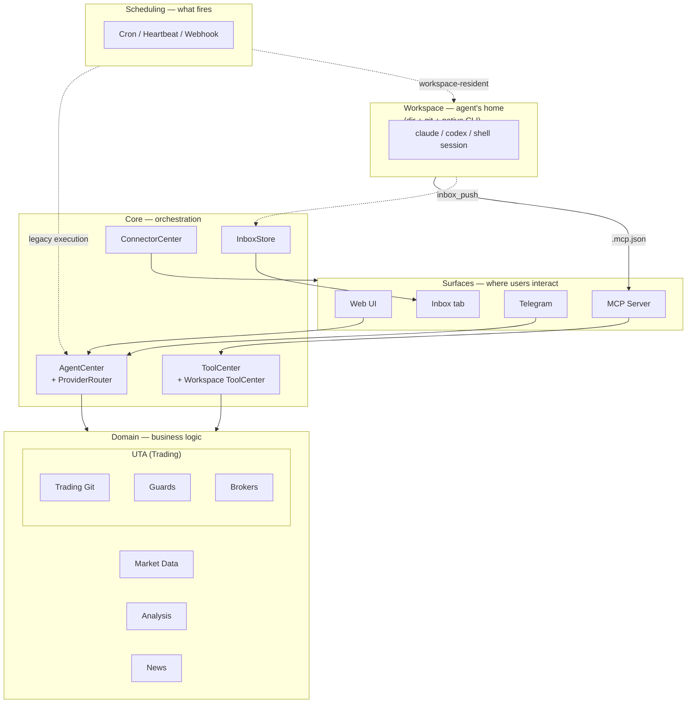

<p align="center">
  
</p>

<h1 align="center">OpenAlice</h1>

<p align="center">
  <strong>Your one-person Wall Street.</strong><br>
  An AI trading agent covering equities, crypto, commodities, forex, and macro — from research through position entry, ongoing management, to exit.
</p>

<p align="center">
  <a href="https://openalice.ai"></a> · <a href="https://openalice.ai/docs"></a> · <a href="https://x.com/OpenAliceAI"></a> · <a href="https://discord.gg/zf4STmrQd8"></a> · <a href="https://qm.qq.com/q/iSg6O4FmrC"></a>
</p>

<p align="center">
  
</p>

- **Full-spectrum** — analyze and trade across asset classes. Multiple brokers combine into one unified workspace so you're never stuck with "I can see it but can't trade it."
- **Full-lifecycle** — not just entry signals. Research, position sizing, ongoing monitoring, risk management, and exit decisions — Alice covers the entire trading lifecycle, 24/7.
- **Full-control** — every trade goes through version history and safety checks, and requires your explicit approval before execution. You see every step, you can stop every step.

Alice runs on your own machine, because trading involves private keys and real money — that trust can't be outsourced.

> [!CAUTION]
> **OpenAlice is experimental software in active development.** Many features and interfaces are incomplete and subject to breaking changes. Do not use this software for live trading with real funds unless you fully understand and accept the risks involved. The authors provide no guarantees of correctness, reliability, or profitability, and accept no liability for financial losses.

## Features

### Trading

- **Unified Trading Account (UTA)** — multiple brokers (CCXT, Alpaca, Interactive Brokers) combine into unified workspaces. AI interacts with UTAs, never with brokers directly
- **Trading-as-Git** — stage orders, commit with a message, push to execute. Full history reviewable with commit hashes
- **Guard pipeline** — pre-execution safety checks (max position size, cooldown, symbol whitelist) per account
- **Account snapshots** — periodic and event-driven state capture with equity curve visualization

### Research & Analysis

- **Market data** — equity, crypto, commodity, currency, and macro data via TypeScript-native OpenBB engine. Unified cross-asset symbol search and technical indicator calculator
- **Fundamental research** — company profiles, financial statements, ratios, analyst estimates, earnings calendar, insider trading, and market movers. Currently deepest for equities, expanding to other asset classes
- **News** — background RSS collection with archive search

### Automation

Automation has two layers in OpenAlice. They're worth separating because each evolves on its own track:

**Scheduling — *what* fires an AI call.** A typed append-only event log + cron engine that emits events on a schedule. Stable, reusable across both old and new execution models.

- **Cron scheduling** — cron expressions, intervals, or one-shot timestamps
- **Heartbeat** — a periodic timer with active-hours filtering and a dedup window
- **Webhooks** — inbound event triggers from external systems (planned)

**Execution — *how* the trigger lands.** Today's heartbeat and cron jobs still use the pre-Workspace wiring: event → AgentCenter (the global chat) → AI run → optional `notify_user` → NotificationsStore → Connectors. That path is fine for "one-in, one-out" pings — heartbeat updates, scheduled market checks — and remains in production. The direction we're moving in: workspace-resident executions, where a scheduled event either fires a one-shot task inside a Workspace OR drives continued dialog on a Workspace's persistent Session. The scheduling layer above is shared either way.

### Interface

- **Web UI** — chat with SSE streaming, sub-channels, portfolio dashboard with equity curve, and full config management
- **Workspace** — a per-task directory + git repo + persistent terminal session running your chosen agent CLI (`claude` / `codex` / `shell`) with OpenAlice's MCP tools plumbed in. The recommended path for any non-trivial AI work — native prompt cache, native rendering, no protocol shim
- **Inbox** — workspace-to-user push channel. Agents call `inbox_push` from inside a workspace to surface a document (rendered live) plus a markdown comment in a dedicated tab; click the reply bar to jump back into the workspace and continue
- **Telegram** — mobile access with trading panel
- **MCP server** — tool exposure for external agents

### And More!

- **Multi-provider AI** — Claude (Agent SDK with OAuth or API key) or Vercel AI SDK (Anthropic, OpenAI, Google), switchable at runtime
- **Evolution mode** — permission escalation that gives Alice full project access including Bash, enabling self-modification


## Architecture



**Surfaces** — external places where users interact with Alice: Web UI (chat, Inbox tab, portfolio dashboards), Telegram, MCP Server. ConnectorCenter tracks the last-used channel for delivery routing.

**Workspace** — A per-task directory + git repo + persistent terminal session running a native agent CLI. The recommended substrate for non-trivial AI work. Wired to OpenAlice via two MCP servers in `.mcp.json`: a global one (full tool catalog) and a per-workspace one (workspace-scoped tools like `inbox_push`, with the wsId carried in the URL path so the agent never traffics its own identity).

**Core** — AgentCenter + ProviderRouter route AI calls to the active provider. ToolCenter is the shared registry for global tools; WorkspaceToolCenter holds per-workspace tool factories. InboxStore is an append-only JSONL behind the Inbox tab; ConnectorCenter routes outbound messages on the legacy path.

**Domain** — UTA is the trading workspace (broker connection + git history + guards). Market Data, Analysis, and News are independent modules, each exposed to AI through tool registrations.

**Scheduling** — Cron, the heartbeat timer, and webhook ingest fire events on a schedule. *What* the event drives is the execution layer: today's heartbeat and cron still take the legacy path through AgentCenter (dotted line — the "one-in, one-out" AI call pattern); the direction we're moving in is workspace-resident execution where a scheduled event either fires a one-shot task inside a Workspace or drives continued dialog on a persistent Session.

## Key Concepts

**UTA (Unified Trading Account)** — The core abstraction. Each UTA wraps a broker connection, operation history, guard pipeline, and snapshot scheduler into a single self-contained workspace. AI and the frontend interact with UTAs exclusively — brokers are internal implementation details. Multiple UTAs work like independent repositories: one for Alpaca US equities, one for Bybit crypto, each with its own history and guards.

**Trading-as-Git** — The workflow inside each UTA. Stage orders, commit with a message, then push to execute. Push runs guards, dispatches to the broker, snapshots account state, and records a commit with an 8-char hash. Full history is reviewable like `git log` / `git show`.

**Guard** — A pre-execution safety check that runs inside a UTA before orders reach the broker. Guards enforce limits (max position size, cooldown between trades, symbol whitelist) and are configured per-account. Think of it as ESLint for trading — automated rules that catch problems before they go live.

**Heartbeat** — A scheduling pattern: a recurring timer with an active-hours filter and a dedup window for the message body. The pattern is general; today its execution wiring routes through the pre-Workspace path (AgentCenter → `notify_user` → NotificationsStore → connectors), so a heartbeat tick currently delivers as a message in your last-used channel. As Workspace-resident autonomous work matures, the same scheduling primitive will be wired into workspace executions too.

**Connector** — An external interface through which users interact with Alice. Built-in: Web UI, Telegram, MCP Ask. Delivery always goes to the channel you last spoke through.

**AI Provider** — The AI backend that powers Alice. Claude (via Agent SDK, supports OAuth login or API key) or Vercel AI SDK (Anthropic, OpenAI, Google). Switchable at runtime — no restart needed.

**Workspace** — A directory + git repo + persistent terminal session running a native agent CLI (`claude`, `codex`, or `shell`) of your choice. OpenAlice plumbs its MCP servers into the workspace via `.mcp.json`, so the agent inside sees the workspace's local files plus OpenAlice's full tool surface (trading, market data, news, analysis). Workspaces live under `~/.openalice/workspaces/<wsId>/` — each is its own self-contained scratch directory the agent can read, write, and `git commit` inside. This is the recommended substrate for any non-trivial AI work: native prompt cache, native CLI rendering, no protocol shim between you and the model. Capability extensions (browser automation, third-party CLIs, custom scrapers) ship as new workspace **templates** rather than `src/` dependencies, keeping the main repo small.

**Templates & satellite repos** — A workspace template is a bootstrap script + initial file set that materializes a workspace of a particular shape (today: `chat`, `auto-quant`). Templates are how OpenAlice's ecosystem grows without bloating the main repo: when a new capability (a research toolkit, a backtest harness, a custom MCP server) is worth packaging, it lives in its own **satellite repo** that a template clones at bootstrap time. The main repo deliberately doesn't accept ecosystem PRs — it owns the Trading domain and the workspace launcher; everything else routes through satellite repos referenced by templates. Means template authors can ship on their own cadence, and OpenAlice's `src/` stays small.

**Inbox** — Workspace-to-user push channel. Agents working inside a workspace call the `inbox_push` MCP tool to surface docs (rendered live from workspace files) plus markdown commentary in a dedicated Inbox tab. The user reads, then clicks the reply bar at the bottom of the entry to jump back into the workspace's session and continue the conversation there. Inbox is distinct from the legacy **Notifications** surface (now demoted into the Chat sidebar's Traditional section) — that one is reserved for pre-Workspace Automation flows (heartbeat / cron pushes).

## Two kinds of chat

OpenAlice ships two paths for chatting with Alice. They have very different performance characteristics, and picking the right one matters more than it looks.

### Workspace chat (recommended when available)

A chat-type **workspace** is a directory + git repo + a persistent terminal session running the native CLI of your chosen agent (`claude`, `codex`, or `shell`). The CLI process handles all model interaction, prompt caching, and rendering — OpenAlice's job is to plumb its MCP server into the workspace and surface the terminal in the UI.

- **Native prompt cache.** Claude Code, Codex, and the other agent CLIs implement vendor-specific cache control we can't replicate. On a long conversation this is often a 10× cost reduction.
- **Native frontend.** TUI rendering, syntax highlighting, diff display — the CLI vendor has already tuned these for their model.
- **Full tool surface.** The CLI sees the workspace's local files plus OpenAlice's MCP tools. No "greatest-common-denominator" trimming.
- **Stable.** No `ChatHook` protocol layer between you and the model.

The only requirement: the CLI binary has to be installed on the host running OpenAlice.

### Traditional chat

The original `/chat` page. OpenAlice's `ChatHook` calls the agent SDK (Vercel AI SDK or Anthropic Agent SDK) directly, normalizes events through its own layer, and renders them.

- **No shell required.** Works in any environment OpenAlice runs in.
- **Reachable by connectors.** Telegram, MCP Ask, and webhook-pushed messages all land here because those surfaces have no terminal to host a CLI in.

The cost: token usage is high (cache control is OpenAlice's responsibility and still incomplete), capability is constrained (each new CLI feature has to be re-implemented at the `ChatHook` layer), and `ChatHook` itself is still maturing.

### Which one should I use?

| Scenario | Use |
| --- | --- |
| Interactive UI chats with Alice on this machine | **Workspace chat** |
| Connector-pushed messages (Telegram bot, webhook callbacks) | Traditional chat |
| Long sessions where token cost matters | **Workspace chat** |
| Environment with no shell / no CLI installed | Traditional chat |

Today the connectors are wired to traditional chat. Workspace chat is the recommended path going forward; Traditional remains in place specifically because connector-driven flows (Telegram, MCP Ask, webhook callbacks) have no terminal to host a CLI in. If shell-bridged connectors arrive later, they can opt into workspace chat too.

## Quick Start

Prerequisites: Node.js 22+, pnpm 10+, [Claude Code CLI](https://docs.anthropic.com/en/docs/claude-code) installed and authenticated.

```bash
git clone https://github.com/TraderAlice/OpenAlice.git
cd OpenAlice
pnpm install && pnpm build
pnpm dev
```

Open [localhost:3002](http://localhost:3002) and start chatting. No API keys or config needed — the default setup uses your local Claude Code login (Claude Pro/Max subscription).

### Windows

OpenAlice's Workspace feature spawns bash-based bootstrap scripts to materialize new workspaces, so a POSIX shell environment is required:

- **Recommended:** install [Git for Windows](https://gitforwindows.org/) and accept the default *"Use Git from the Windows Command Prompt"* option during setup — this puts `bash` plus the POSIX utilities the scripts depend on (`sed`, `cp`, `mkdir`, `basename`, `printf`, etc.) on your PATH.
- **Alternative:** run OpenAlice from inside [WSL2](https://learn.microsoft.com/en-us/windows/wsl/install) — the Linux env handles everything natively.

Native `cmd.exe` / PowerShell alone are not supported (no `bash`, no POSIX utilities). If `bash` isn't on PATH when you create a workspace, the bootstrap fails with an inline hint pointing back here.

Note: we don't currently dogfood OpenAlice on Windows, so the broader experience (PTY rendering, file watching, paths with spaces) may have rough edges. Bug reports very welcome.

## Configuration

All config lives in `data/config/` as JSON files with Zod validation. Missing files fall back to sensible defaults. You can edit these files directly or use the Web UI.

**AI Provider** — The default provider is Claude (Agent SDK), which uses your local Claude Code login — no API key needed. To use the [Vercel AI SDK](https://sdk.vercel.ai/docs) instead (Anthropic, OpenAI, Google, etc.), switch `ai-provider.json` to `vercel-ai-sdk` and add your API key. Both can be switched at runtime via the Web UI.

**Trading** — Unified Trading Account (UTA) architecture. Each account in `accounts.json` becomes a UTA with its own broker connection, git history, and guard config. Broker-specific settings live in the `brokerConfig` field — each broker type declares its own schema and validates it internally.

| File | Purpose |
|------|---------|
| `engine.json` | Trading pairs, tick interval, timeframe |
| `agent.json` | Max agent steps, evolution mode toggle, Claude Code tool permissions |
| `ai-provider.json` | Active AI provider (`agent-sdk` or `vercel-ai-sdk`), login method, switchable at runtime |
| `accounts.json` | Trading accounts with `type`, `enabled`, `guards`, and `brokerConfig` (broker-specific settings) |
| `connectors.json` | Web/MCP server ports, MCP Ask enable |
| `telegram.json` | Telegram bot credentials + enable |
| `web-subchannels.json` | Web UI sub-channel definitions with per-channel AI provider overrides |
| `tools.json` | Tool enable/disable configuration |
| `market-data.json` | Data backend (`typebb-sdk` / `openbb-api`), per-asset-class providers, provider API keys, embedded HTTP server config |
| `news.json` | RSS feeds, fetch interval, retention period |
| `snapshot.json` | Account snapshot interval and retention |
| `compaction.json` | Context window limits, auto-compaction thresholds |
| `heartbeat.json` | Heartbeat enable/disable, interval, active hours |

Persona and heartbeat prompts use a **default + user override** pattern:

| Default (git-tracked) | User override (gitignored) |
|------------------------|---------------------------|
| `default/persona.default.md` | `data/brain/persona.md` |
| `default/heartbeat.default.md` | `data/brain/heartbeat.md` |

On first run, defaults are auto-copied to the user override path. Edit the user files to customize without touching version control.

## Project Structure

OpenAlice is a pnpm monorepo with Turborepo build orchestration. See [docs/project-structure.md](docs/project-structure.md) for the full file tree.

## Roadmap to v1

OpenAlice is in pre-release. All planned v1 milestones are now complete — remaining work is testing and stabilization.

- [x] **Tool confirmation** — achieved through Trading-as-Git's push approval mechanism. Order execution requires explicit user approval at the push step, similar to merging a PR
- [x] **Trading-as-Git stable interface** — the core workflow (stage → commit → push → approval) is stable and running in production
- [x] **IBKR broker** — Interactive Brokers integration via TWS/Gateway. `IbkrBroker` bridges the callback-based `@traderalice/ibkr` SDK to the Promise-based `IBroker` interface via `RequestBridge`. Supports all IBroker methods including conId-based contract resolution
- [x] **Account snapshot & analytics** — periodic and event-driven snapshots with equity curve visualization, configurable intervals, and carry-forward for data gaps

## Getting Help

Stuck? Here's the recommended path, roughly in order:

1. **Let an AI agent fix it** — Claude Code, Cursor, or any other coding agent can read the codebase and patch most issues directly. Fastest path for bugs and "how do I do X" questions
2. **[Ask DeepWiki](https://deepwiki.com/TraderAlice/OpenAlice)** — natural-language Q&A over the entire codebase, good for architectural questions and figuring out where to look
3. **Community** — [Discord](https://discord.gg/zf4STmrQd8) for English speakers, [QQ 群](https://qm.qq.com/q/iSg6O4FmrC) for 中文开发者. For things AI can't answer — design discussions, edge cases, or just hanging out

## Star History

[](https://star-history.com/#TraderAlice/OpenAlice&Date)

## License

[AGPL-3.0](LICENSE)