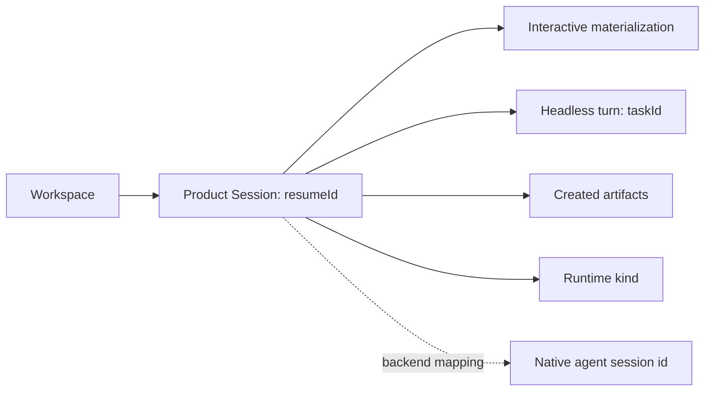

# Workspace Session and Artifact Provenance

This guide owns the product identity and provenance model for Workspace
Sessions and everything they create: reports, Inbox notifications, Issues, and
trade decisions. It is the design spine for features such as “ask the sender,”
“ask the Issue owner,” and “why did this agent initiate this trade?”

## Session signature

`resumeId` is OpenAlice's unique Session identity; `@resumeId` is its visible
signature. Every live interactive/headless Agent receives
`OPENALICE_RESUME_ID` and `OPENALICE_SIGNATURE`, while
`alice-workspace signature show` resolves the same identity through the
authoritative request origin. Environment values help the Agent remember its
name; server-side origin resolution remains the authority for structured
Inbox, Issue, and trade actions.

Standalone Markdown stays self-contained and should end with:

```md
---

Signed-by: @resume-calm-amber-river-a1b2c3
```

The UI renders that signature as a link back to the exact product Session.
Reports do not need a parallel metadata sidecar merely to carry authorship.

Related guides: [[docs/project-structure.md]] and
[[docs/workspace-issues-and-scheduling.md]]. This is a provenance/indexing
contract, not a revival of the retired event-bus scheduler described in
[[docs/event-system.md]].

## First Principle: `resumeId` Is the Product Session Handle

A Workspace contains product Sessions. One product Session is the durable,
stateful conversation with a particular agent context, whether its current turn
runs in an interactive PTY or headless process.

`resumeId` is the canonical identity of that Session:

- restoring a Session uses `resumeId`;
- indexing the same Session across headless and interactive turns uses
  `resumeId`;
- artifacts created by that Session attribute themselves to `resumeId`;
- another agent asks that exact Session by `resumeId`;
- a new worker, even with the same runtime in the same Workspace, receives a
  new `resumeId` and is therefore a different product Session.

The current `SessionRecord.id` is a durable UI/PTY materialization record. A
`taskId` is one headless execution. `agentSessionId` is the native CLI's private
conversation locator. None replaces `resumeId` as product identity.



In the office analogy, the Workspace is the desk and the product Session is one
particular colleague-with-context. `pi`, `codex`, `opencode`, and `claude` are
worker kinds, not unique colleagues.

## Layered Index

OpenAlice should resolve provenance through five layers rather than treating
every identifier as a kind of Session:

| Layer | Canonical key | Meaning |
|---|---|---|
| Workspace | `workspaceId` | The durable desk, files, capabilities, and local context |
| Product Session | `resumeId` | The unique stateful agent conversation and follow-up target |
| Execution | `taskId` or `SessionRecord.id` | One headless turn or one interactive materialization |
| Artifact | Typed business reference | Report, Inbox entry, Issue, or trade decision created by a Session |
| Runtime transport | `(agent, agentSessionId)` | Backend-only native CLI continuation locator |

The normal lookup direction is:

```text
business object
  -> provenance occurrence (created / updated / sent / decided)
  -> resumeId
  -> Workspace + runtime kind
  -> backend-native continuation transport
```

Reverse indexes such as `resumeId -> artifacts` and `taskId -> Inbox entries`
support activity feeds and auditing, but do not change the forward semantics.

### Identity scope

| Identity | Scope and lifetime | May be exposed to agents/UI? |
|---|---|---|
| `workspaceId` | Global within one OpenAlice root; durable | Yes |
| `{ workspaceId, issueId }` | `issueId` is only unique inside its Workspace | Yes, as a pair |
| `inboxEntryId` | Global immutable notification id | Yes |
| `{ workspaceId, path, revision? }` | Report/document identity; revision disambiguates mutable content | Yes |
| `taskId` / `runId` | Global id for one headless turn | Yes, as execution evidence |
| `resumeId` | Global durable product Session id | **Yes; canonical follow-up handle** |
| `SessionRecord.id` | Launcher-owned interactive materialization | Only where UI attachment needs it |
| `agent` | Runtime kind repeated across many Sessions | Yes, but never as unique identity |
| `agentSessionId` | Vendor/runtime scoped native locator | No; backend only |
| PID/live PTY | Ephemeral process incarnation | No |

`ResumeRegistry` must bind a `resumeId` immutably to one `workspaceId` and one
runtime kind. It may learn or refresh the native locator, but it must never
reassign the product Session to another Workspace or runtime.

## Standard Provenance Envelope

Every attributable business-object occurrence should carry the same safe
Session origin:

```ts
interface SessionOrigin {
  kind: 'session'
  workspaceId: string
  resumeId: string
  agent: string
  execution?:
    | { kind: 'headless'; taskId: string }
    | { kind: 'interactive'; sessionRecordId: string }
}
```

- `resumeId` says **who** to ask.
- `workspaceId` says where that Session's context lives.
- `agent` describes the runtime kind and is useful for display/diagnostics.
- `execution` identifies the exact headless turn or attended materialization
  that produced the occurrence.

OpenAlice stamps this envelope from authoritative spawn/session context. An
agent does not claim an arbitrary origin through tool arguments. Native runtime
ids never enter the envelope.

The logical provenance index stores immutable attribution edges:

```ts
type ArtifactRef =
  | { kind: 'report'; workspaceId: string; path: string; revision?: string }
  | { kind: 'inbox'; inboxEntryId: string }
  | { kind: 'issue'; workspaceId: string; issueId: string }
  | { kind: 'trade-decision'; accountId: string; decisionId: string }

interface ProvenanceEdge {
  artifact: ArtifactRef
  action: 'created' | 'updated' | 'commented' | 'sent' | 'decided' | 'reconstructed'
  origin: SessionOrigin | { kind: 'human' } | { kind: 'external'; system: string }
  at: number
}
```

Mutable artifacts retain multiple meaningful edges. Creation, later editing
sessions, publication, and repeated execution are different occurrences and may
belong to different Sessions or a human. High-frequency `updated` writes from
the same origin to the same artifact are one editing activity: OpenAlice
coalesces adjacent updates within fifteen minutes instead of treating autosave or
several small agent patches as distinct user-facing events. Intervening actions
such as comments or a different origin always start a new activity.

## Universal Follow-up Rule

The resolver follows one policy across every product surface:

1. **Known Session:** if the requested occurrence has a `resumeId`, the follow-up
   must continue that exact product Session.
2. **Known but unavailable Session:** preserve the attribution and report that
   it cannot be resumed. Do not silently replace the owner with a new worker.
3. **Unknown Session, known Workspace:** ask the Workspace to create a fresh
   worker. That worker receives a new `resumeId` and reconstructs the answer
   from Workspace material.
4. **Unknown Workspace:** there is no safe agent target. Return unavailable and
   preserve whatever historical/external evidence exists.

Every resolution reports how it chose the answerer:

```ts
type FollowUpResolution =
  | { mode: 'exact'; origin: SessionOrigin }
  | {
      mode: 'unavailable'
      attributedOrigin?: SessionOrigin
      reason: 'missing-session' | 'missing-native-session' | 'deleted-workspace'
    }
  | {
      mode: 'reconstructed'
      workspaceId: string
      resumeId: string
      agent: string
      reason: 'missing-origin' | 'unavailable-origin' | 'external-origin'
    }
```

`reconstructed` is a newly created Session, not the original author. It may
become the continuing analyst for later questions, but its provenance must be
recorded as reconstruction and must not overwrite the artifact's historical
origin.

Selecting “latest successful run” or “latest editor” is an explicit query over
provenance edges. It is not a fallback definition of original ownership.

## Artifact Contracts

### Reports and Workspace documents

Reports are currently Markdown files. Their durable identity is at least
`{ workspaceId, path }`; asking about mutable contents additionally needs a
revision (git commit, content hash, or another immutable version handle).

`inbox_push` stamps a `sha256:<hex>` revision from the report bytes it publishes
and uses that same revision in both the Inbox attachment and report provenance
edge. Rendering remains live; the hash identifies what was sent rather than
freezing a second copy of the file.

A report can have separate provenance for:

- initial creation;
- each attributable update;
- publication through Inbox;
- a later human edit.

The Session that sent an Inbox notification can answer “why did you publish
this?” It is not necessarily the author of the current file after subsequent
edits. Without revision/mutation provenance, OpenAlice must say it is asking a
new Session to reconstruct the current document.

Native agent file tools can bypass Alice's current mutation seams. Future
capture may use normalized file-change blocks, Workspace git revisions, or a
dedicated report-writing capability, but no surface may invent authorship from
the Workspace default runtime.

### Inbox

Inbox is an immutable notification/delivery occurrence. The notification must
carry the `SessionOrigin` of the Session that called `inbox_push`:

```text
Inbox entry -> sender resumeId -> exact product Session
```

This answers “who sent this message?” independently from who last edited any
live document linked by the notification. Legacy/manual entries may have only a
Workspace; those resolve through the explicit reconstruction path.

### Issues: creation provenance versus execution responsibility

An Issue has two independent identity questions:

1. **Creation/mutation provenance:** which Session or human created and edited
   the self-describing Issue?
2. **Current ownership:** is the Work item owned by one product Session or by
   the Workspace, which recruits a new worker for each scheduled fire?

`assignee` is the single answer to the second question; schedule is an intrinsic
capability of that Work item, not a second ownership object.

Issue detail and `alice-workspace issue show` expose `created` / `updated` /
`commented` activity newest-first. Adjacent updates from the same origin are
projected as one editing activity, including historical autosave records written
before store-side coalescing existed. Session origins carry a product
`resumeId`, so a human or agent can continue that exact author without learning
a runtime-native session id. Missing history remains visibly unattributed for
legacy or manual files; it is never inferred from the current assignee,
scheduled owner, or Workspace default runtime.

The Issue detail API also exposes a unified chronological `activity[]` log.
Change activities come from the provenance store; scheduled execution
activities come from the headless run registry. They remain authoritative in
their own persistence systems, while the projection gives UI, CLI, and future
automation one extensible contract for “what happened to this Issue.” New kinds
such as Inbox delivery or schedule skips should extend this activity union
instead of creating another parallel timeline.

#### Mode A: one responsible Session

```yaml
assignee: "@resume-calm-amber-river-a1b2c3"
```

- Every scheduled fire continues that exact `resumeId`.
- The responsible Session may be in another Workspace when the exact signature
  was deliberately carried in from a signed artifact.
- The Session's bound runtime is authoritative; the Issue's top-level `agent`
  cannot override it.
- Run `taskId`s change; the product Session does not.
- Per-`resumeId` serialization prevents overlapping turns.
- If the Session becomes unresumable, the Issue becomes blocked/unavailable;
  it must not silently recruit a replacement and pretend continuity.

For agent-facing `issue_create`, omitted assignee or `@me` binds the caller's
authoritative product Session; OpenAlice resolves and persists the concrete
`@resumeId` server-side. `@me` is never stored. A human UI may select an
existing resumable Workspace Session.

#### Mode B: a fresh worker per fire

```yaml
assignee: "@workspace"
```

- Every scheduled fire creates a new headless product Session and `resumeId`.
- The Issue and Workspace files provide shared continuity; conversational
  memory does not.
- The Issue's top-level `agent` may constrain the runtime kind, but does not name
  a unique worker.
- Each run keeps its own origin so a user can still ask that specific worker.

The Issue's creator provenance is stamped separately in both modes. Workspace
ownership does not erase who designed the Issue.

Migration `0018_issue_assignee_ownership` removes the former `execution` field
and converts its meaning into `assignee`; the runtime does not maintain two
ownership contracts.

Typical questions then resolve without ambiguity:

| User question | Target |
|---|---|
| Why does this Issue exist? | Issue `created` provenance |
| Why was its priority changed? | Matching `updated` provenance |
| Ask the responsible owner | Declared `@resumeId` assignee |
| Why did yesterday's report say this? | That run's `resumeId` |
| What does the latest Workspace worker think? | Explicit latest-run selection |

### Trades

A trade has a causal chain, not one undifferentiated author:

```text
Session decision/request -> human or policy approval -> UTA operation -> broker fills
```

The UTA Git commit is the durable decision artifact. Its identity is scoped by
the account and uses the real commit hash:

```ts
type TradeDecisionRef = {
  kind: 'trade-decision'
  accountId: string
  decisionId: string // UTA Git commit hash
}
```

- `resumeId`, `workspaceId`, and `agent` identify who initiated the decision.
- `taskId` identifies the exact headless turn when applicable.
- staging without a commit is not yet a durable decision occurrence.
- `tradingPush` and broker order/fill ids are execution evidence, not new
  decision identities.
- approval records identify the human/policy gate separately.
- UTA operations and broker records remain the authority for execution/fills.

When an internal agent creates a commit through the Workspace-owned
`alice-uta` CLI, the gateway resolves the out-of-band run/session header and
records a `decided` occurrence. A call without an authoritative Session header
remains unattributed rather than being guessed. Query it with:

```bash
alice-workspace provenance show --kind trade-decision \
  --account-id <account> --decision-id <uta-commit-hash>
```

“Why did you take this trade?” resumes the decision Session. “Why did it fill at
this price?” reads UTA/broker execution evidence. Correlation must not move
broker state, approvals, or trading authority back into Alice.

## Concrete Cases

### One scheduled thesis report

A headless Pi Session writes a thesis report and pushes Inbox. The notification
stamps its `resumeId` and `taskId`. A follow-up resumes that exact Session, which
can explain the original trigger and falsifiers from its conversational context.

### One recurring Issue, multiple workers

A financial/industrial scan has historical Codex runs and later Pi runs. If its
assignee is `workspace`, each report has a different `resumeId`. “Who created
the scan?”, “who wrote the 10 July report?”, and “who ran it most recently?” are
three different provenance queries.

If the user instead wants one analyst to accumulate memory across days, the
Issue must declare `assignee: "@resumeId"` and keep one responsible
product Session.

### Legacy Inbox with no sender Session

The entry has a Workspace and document path but no attributable `resumeId`.
OpenAlice recruits a fresh worker in that Workspace, records its new `resumeId`,
and labels the answer `reconstructed`. It never says it asked the sender.

### A bad trade

The order points to the decision origin Session and separately to UTA execution
records. The decision Session explains the thesis; UTA/broker evidence explains
approval state, routing, fills, and slippage.

## Invariants

1. `resumeId` is the only product-level identity for a resumable Session.
2. A Workspace is a context boundary, not an agent identity.
3. Runtime kind is selection/display metadata, not a unique agent.
4. `taskId` identifies one turn; it never replaces `resumeId`.
5. Native session ids stay behind the backend boundary.
6. Known ownership always continues the known `resumeId`.
7. Unknown ownership creates a new Session at the known Workspace and labels
   the result `reconstructed`.
8. Reconstruction never overwrites historical origin.
9. Mutable artifacts retain occurrence-level provenance instead of one mutable
   “author” field.
10. Issue creation provenance and future execution responsibility are separate.
11. Issue assignee is the only ownership/dispatch contract: `@workspace` or an
    exact `@resumeId` for scheduled work.
12. Trade decision attribution and trade execution authority remain separate.
13. Provenance is stamped from authoritative context, not asserted by an agent.
14. Existing UUID `resumeId`s remain valid; readable ids apply only to new
    Sessions.
15. New `taskId`s are short opaque run codes. Existing UUID task ids remain
    valid, and no second alias id is introduced.

## Delivery Order: Leave the Trail, Then Collaborate

This architecture ships in two deliberate phases. The provenance layer must be
useful without starting or messaging an agent.

### Phase 1: provenance trail and indexes

Phase 1 answers “what produced or changed this, and which Session was
responsible?” It owns:

- a safe Workspace Session directory (`alice-workspace peer sessions`) whose
  only conversation handle is `resumeId`; it is an audit/addressing surface,
  not permission to choose an arbitrary old Session when provenance is absent;
- the standard `SessionOrigin` envelope;
- immutable artifact occurrence edges and their forward/reverse indexes;
- reliable propagation of `resumeId`, Workspace, runtime kind, and optional
  execution id;
- Inbox sender attribution;
- Issue creator/mutation attribution and explicit Workspace/Session ownership;
- report revision/write attribution where observable;
- trade-decision correlation across the Alice -> UTA boundary;
- read-only artifact and reverse-Session queries through
  `alice-workspace provenance show`;
- honest `unknown`/`unavailable` records for legacy, human, or external changes;
- read-only provenance queries and diagnostics.

Phase 1 does **not** decide whom to recruit, start a headless turn, or send a
question. Its acceptance test is: given a concrete business-object occurrence,
OpenAlice can return its attributable Session origin or a precise reason why no
Session origin exists.

### Phase 2: cross-Session collaboration

Phase 2 consumes Phase 1; it does not infer provenance independently. It owns:

- resolving a business-level question to `exact`, `unavailable`, or
  `reconstructed`;
- continuing a known `resumeId` through headless dispatch;
- asking a Workspace to create a new Session only when no usable owner exists;
- polling/streaming the normalized reply and tool activity;
- business-level CLI and UI actions for Inbox, Issues, reports, and trades;
- labeling reconstructed answers so they cannot impersonate an original author.

The embedded generic entry point is:

```bash
alice-workspace conversation ask --resume-id <resumeId> --prompt '<question>'
alice-workspace conversation ask --issue-id <issueId> [--ws-id <workspaceId>] --prompt '<question>'
alice-workspace conversation ask --ws-id <workspaceId> --prompt '<question>'
alice-workspace conversation await --task-id <taskId>
alice-workspace conversation collect --task-id <taskA> --task-id <taskB>
alice-workspace conversation read --task-id <taskId>
```

Inbox and Issue callers normally use the business-level wrappers instead:

```bash
alice-workspace inbox ask --id <entryId> --prompt '<question>' --await
alice-workspace issue ask --id <issueName> --creator --prompt '<question>' --await
alice-workspace issue ask --id <issueName> --owner --prompt '<question>' --await
alice-workspace issue ask --id <issueName> --run-id <taskId> --prompt '<question>' --await
```

The public CLI accepts only flat identity flags. `resumeId` addresses one exact
Session, `issueId` consults the Phase 1 index, and `wsId` recruits a fresh worker
when there is no known owner. Rich Inbox/report/trade target structures stay
inside the resolver and future business-specific convenience commands; agents
never serialize them into `conversation ask`. The ask result reports a compact
`resolution.mode`; read returns runtime status and the latest assistant text by
default. Full tool/message blocks are diagnostic data behind `--mode detailed`.
For one peer, `ask --await` is the preferred path. For multiple peers, dispatch
all asks first so their runs overlap, then server-side collect their task ids in
one ordered result before synthesizing. A timed-out collect preserves every task;
callers fall back to a later collect/read snapshot instead of scripting arbitrary
sleeps.

The first fresh reconstruction appends a `reconstructed` occurrence to the
artifact. Later questions about that same otherwise-unattributed artifact
continue the reconstruction Session instead of recruiting another worker, but
the resolution mode remains `reconstructed`: continuity does not turn that
worker into the historical author.

The human UI uses the same resolver through asynchronous `/api/inquiries`
business routes. Each dispatched headless task persists a safe inquiry subject
(Inbox entry, or Issue + creator/owner/run relation), the original question,
and exact/reconstructed resolution. This reverse link lets Inbox and Issue
pages restore follow-up history after navigation or restart without parsing
prompts or exposing adapter-native session ids. UI requests return immediately
after dispatch; the page polls durable task state instead of holding an
Electron IPC request open for the model turn.

## Phase 2 Feature Design Skeleton

Business convenience wrappers delegate to the same shipped resolver:

```text
inbox ask <entry>             -> sender Session or reconstructed Workspace Session (shipped)
issue ask <issue> --creator   -> creation provenance (shipped)
issue ask <issue> --owner     -> declared Session assignee, or explain Workspace ownership (shipped)
issue ask <issue> --run-id    -> that run's Session (shipped)
report ask <path> [revision]  -> matching writer/update occurrence
trade ask <order> --decision  -> initiating Session
trade ask <order> --execution -> UTA/broker evidence, not an AI conversation
```

Cross-Session collaboration uses one contract: an agent asks a known peer
by `resumeId`; without one, it asks the peer Workspace to create a fresh Session.
No feature should invent its own meaning of “the agent who made this.”

## Current Coverage and Missing Seams

| Area | Current foundation | Phase 1 trail/index | Phase 2 collaboration |
|---|---|---|---|
| Product Session | `ResumeRegistry`, headless `resumeId`, interactive materialization | Standard origin projection and read-only lookup | Continue exact or create reconstructed Session |
| Execution | `HeadlessTaskRegistry`, `parentTaskId`, normalized output | Bind every attributable occurrence to the execution and `resumeId` | Poll/stream the peer reply and tool activity |
| Inbox | Server-stamped run/session origin | Safe exposure and legacy/unknown classification | Ask sender or reconstruct at Workspace |
| Issue | `{ workspaceId, issueId }`, run and Inbox activity | Creator/mutation edges plus explicit Workspace/Session ownership | Ask creator, owner, or one selected run |
| Report | Workspace path and git repository | Revision-level creation/update attribution | Ask writer of the selected revision |
| Trade | UTA operation/order authority | Alice Session decision correlation across the UTA boundary | Ask initiator; route execution questions to UTA evidence |

Phase 1 remains the only source of attribution. Business-specific one-click
features may wrap the generic conversation command, but must not reimplement
origin selection. This document is the semantic owner; surface code and API
shapes should point back here rather than restating the rules differently.

## Load-Bearing Paths

| Path | Responsibility |
|---|---|
| `src/workspaces/resume-registry.ts` | Product Session -> native runtime mapping |
| `src/workspaces/headless-task-registry.ts` | Per-turn history and Session lineage |
| `src/workspaces/session-registry.ts` | Interactive materializations and resume indexes |
| `src/workspaces/service.ts` | Dispatch, resume, and per-Session concurrency |
| `src/workspaces/conversation-control.ts` | Provenance resolution plus exact/reconstructed headless dispatch |
| `src/tool/conversation.ts` | Embedded business-target ask/read CLI tools |
| `src/webui/routes/inquiries.ts` | Human Inbox/Issue ask dispatch and durable inquiry projections |
| `src/core/inbox-store.ts` | Immutable notification records and sender provenance |
| `src/server/inbox-origin.ts` | Server-side run/session attribution |
| `src/workspaces/issues/declaration.ts` | Workspace-local Issue declaration |
| `src/workspaces/issues/mutate.ts` | Shared Issue mutation seam |
| `src/workspaces/issues/board.ts` | Issue/run/Inbox projections |
| `src/services/uta-client/` | Alice -> UTA decision-correlation boundary |
| `services/uta/src/domain/trading/` | Broker operation and execution authority |
